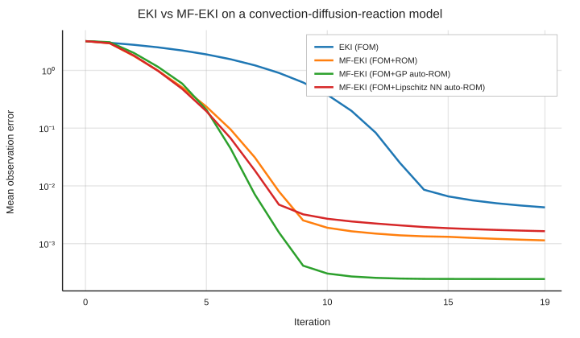

EKI and MF-EKI Demo
===================

This demo compares single-fidelity EKI with three multifidelity variants on a
convection-diffusion-reaction (CDR) model with two inferred parameters:

* EKI using only the full-order model (FOM),
* MF-EKI using a tailored projection-based ROM,
* MF-EKI using automatic on-the-fly Gaussian-process surrogate construction,
  and
* MF-EKI using an automatically rebuilt Lipschitz-constrained neural-network
  surrogate.

The forward model solves a steady 2D CDR equation on a structured grid, and the
QoI is the right-boundary flux functional used in the existing UQ examples.
The example estimates the diffusion coefficient ``nu`` and reaction rate
``sigma`` from a synthetic observation.

Neural-network surrogate
------------------------

The neural-network case uses the standard romtools neural surrogate with two
hidden layers and a width of three times the parameter dimension. The published
benchmark uses 5,000 Adam iterations for each surrogate rebuild. Parameters and
targets are normalized before training.

The network is constrained to be Lipschitz using spectral normalization. The
global Lipschitz constant is estimated from the maximum pairwise slope in the
normalized training data and multiplied by a safety factor of ``1.1``. The
resulting global bound is distributed evenly over the linear layers. This gives
the neural surrogate an explicit smoothness constraint while retaining the same
adaptive rebuild logic used by the other MF-EKI surrogates.

PyTorch is an optional dependency. Install neural-network support with

.. code-block:: bash

   pip install "romtools[WithTorch]"

Run the demo
------------

The canonical implementation lives under ``examples/`` and is validated against
the current romtools checkout in CI.

.. code-block:: bash

   python examples/eki_mf_eki_demo/example.py

A reduced configuration is available for quick validation. It uses the same
four model paths but reduces the neural-network training to 100 Adam iterations:

.. code-block:: bash

   python examples/eki_mf_eki_demo/example.py --smoke

Regenerate the published figure
-------------------------------

The documentation build does not execute this scientific demo implicitly.
Regenerate the checked-in figure explicitly after changes that affect the
benchmark:

.. code-block:: bash

   python examples/eki_mf_eki_demo/example.py \
       --output docs/source/demos/notebooks/eki_mf_eki_demo.svg

Results
-------

   Mean observation error across iterations for single-fidelity EKI,
   multifidelity EKI with a tailored ROM, multifidelity EKI with automatic
   Gaussian-process surrogate construction, and multifidelity EKI with a
   Lipschitz-constrained neural-network surrogate.

For this benchmark, the Gaussian-process surrogate gives the lowest final
observation error. The Lipschitz-constrained neural surrogate reduces the error
much more rapidly than single-fidelity EKI during the early iterations, but
levels off above the Gaussian-process and tailored-ROM results in the later
iterations. At iteration 19, the mean observation errors are approximately
``2.4e-4`` for the Gaussian process, ``1.1e-3`` for the tailored ROM,
``1.6e-3`` for the Lipschitz neural network, and ``4.2e-3`` for single-fidelity
EKI.

Implementation
--------------

.. literalinclude:: ../../../examples/eki_mf_eki_demo/example.py
   :language: python
   :linenos:
