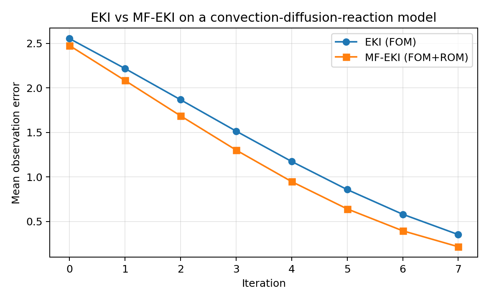

EKI and MF-EKI Demo
===================

This demo showcases single-fidelity EKI and multi-fidelity EKI on a
convection-diffusion-reaction (CDR) model with two inferred parameters.
It mirrors the UQ-style workflow used elsewhere in the demos and keeps the
physics lightweight enough to run quickly.

The forward model solves a steady 2D CDR equation on a structured grid, and the
QoI is the right-boundary flux functional used in the existing UQ examples. EKI
estimates the diffusion coefficient `nu` and reaction rate `sigma` from a
synthetic observation. MF‑EKI augments each iteration with ROM evaluations built
from FOM snapshots, illustrating how multi-fidelity updates reduce error at
lower cost.

Run the demo
------------

.. code-block:: bash

   python docs/source/demos/notebooks/eki_mf_eki_demo.py

Results
-------

   Mean observation error across iterations for EKI and MF-EKI.

Implementation
--------------

.. literalinclude:: notebooks/eki_mf_eki_demo.py
   :language: python
   :linenos:
