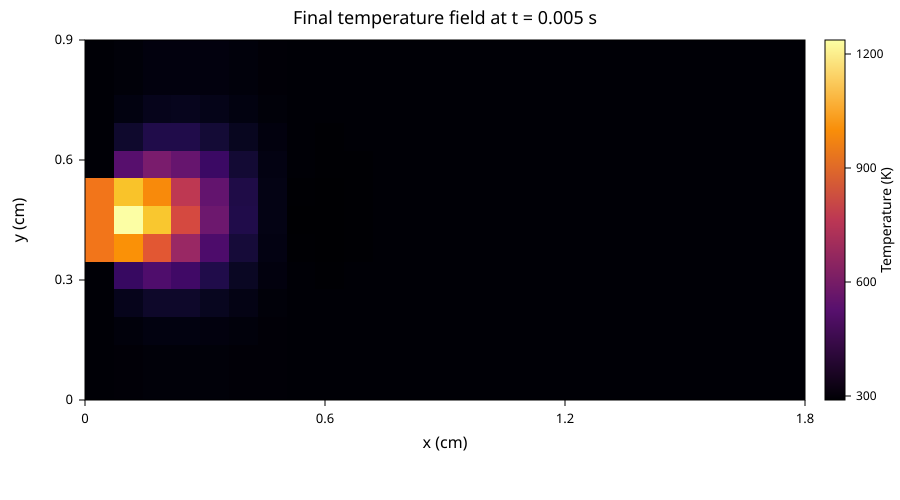

H2-air flame model
==================

The examples include a self-contained, pure-Python model of a two-dimensional
premixed H2-air flame. It provides a moderately challenging benchmark for
romtools workflows while requiring only NumPy and SciPy.

The core solver and romtools QoI wrapper live in ``examples/models``. A quick
wrapper smoke test can be run from the repository root with

.. code-block:: bash

   python examples/models/h2_air_flame_model.py

Problem definition
------------------

The state contains hydrogen, oxygen, and water mass fractions together with a
nondimensional temperature,

.. math::

   \boldsymbol{u} = [Y_{H_2}, Y_{O_2}, Y_{H_2O}, \theta]^T,
   \qquad \theta = T / T_{\mathrm{ref}},

on a rectangular domain of size 1.8 cm by 0.9 cm. The semi-discrete model
combines advection, diffusion, and an Arrhenius reaction source. A hot
premixed inlet occupies the middle third of the left boundary, with ambient
Dirichlet data above and below it and homogeneous-Neumann conditions on the
remaining boundaries.

The four model parameters are

``kappa``
   Diffusivity.

``scaled_activation_energy``
   Activation energy divided by 1000. A representative value is 8.0,
   corresponding to an activation energy of 8000.

``beta_x`` and ``beta_y``
   Components of the advection velocity in cm/s. ``beta_x`` is restricted to
   nonnegative values because the benchmark inlet and x-upwind stencil assume
   left-to-right flow.

A representative parameter vector is

.. math::

   (\kappa, E/1000, \beta_x, \beta_y) = (2, 8, 40, 7).

The solver uses Crank-Nicolson time integration, central differences for
diffusion, a second-order backward upwind stencil in the x direction, and an
upwind stencil in the y direction. Newton systems are assembled and solved as
SciPy sparse matrices.

Direct use
----------

The core solver is independent of romtools workflow interfaces. From
``examples/models``:

.. code-block:: python

   from h2_air_flame import H2AirFlame

   model = H2AirFlame(
       nx=25,
       ny=13,
       dt=1.0e-4,
       t_end=5.0e-3,
       snapshot_stride=10,
   )
   states, times = model.solve(
       kappa=2.0,
       scaled_activation_energy=8.0,
       beta_x=40.0,
       beta_y=7.0,
   )

``states`` has shape ``(num_snapshots, 4, nx, ny)``. The temperature field is
stored as ``theta = T / 300 K`` so that the four state components remain on a
more useful scale for reduced-order modeling. Dimensional temperature is
therefore ``300 * states[:, 3]``.

Default solution plot
---------------------

The figure below shows the final temperature field for the default lightweight
configuration and the representative parameter vector

.. math::

   (\kappa, E/1000, \beta_x, \beta_y) = (2, 8, 40, 7).

This corresponds to ``nx = 25``, ``ny = 13``, ``dt = 1e-4``, and
``t_end = 5e-3``.

   Final temperature field at ``t = 0.005 s`` for the default configuration.

QoI model for romtools workflows
--------------------------------

``H2AirFlameQoiModel`` provides the standard romtools model protocol. It uses
regularly strided temperature sensors as the QoI and writes both the QoI and
full state history to each run directory. Saving the state history allows the
same FOM evaluations to be reused later by state-based ROM builders.

.. code-block:: python

   from h2_air_flame_model import H2AirFlameQoiModel

   qoi_model = H2AirFlameQoiModel(
       nx=25,
       ny=13,
       dt=1.0e-4,
       t_end=5.0e-3,
       snapshot_stride=10,
       spatial_sensor_stride=4,
   )

   sample = {
       "kappa": 2.0,
       "scaled_activation_energy": 8.0,
       "beta_x": 40.0,
       "beta_y": 7.0,
   }

   qoi_model.populate_run_directory("run_0", sample)
   qoi_model.run_model("run_0", sample)
   qoi = qoi_model.compute_qoi("run_0", sample)

This wrapper can be passed directly to romtools workflows that consume a QoI
model.

Computational cost
------------------

The default constructor values are intended to be lightweight enough for
interactive experimentation. Increasing the spatial resolution or time horizon,
or reducing the time step, increases the cost of the implicit nonlinear solve.
Benchmark studies should therefore report model-evaluation counts together with
wall-clock cost when comparing algorithms.

Implementation
--------------

Core flame solver:

.. literalinclude:: ../../../examples/models/h2_air_flame.py
   :language: python
   :linenos:

romtools QoI wrapper:

.. literalinclude:: ../../../examples/models/h2_air_flame_model.py
   :language: python
   :linenos:
