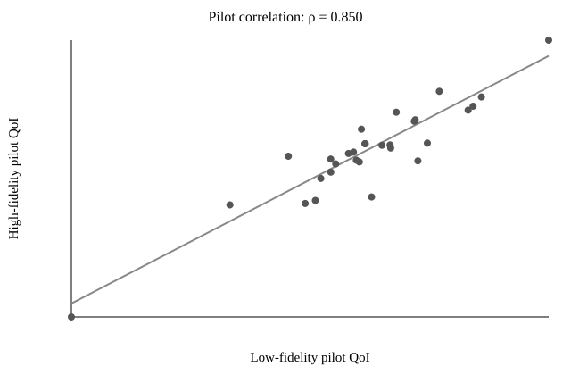
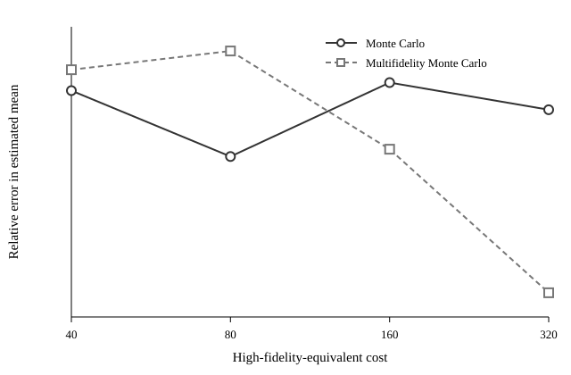

Monte Carlo UQ for Convection-Diffusion-Reaction
================================================

This example compares standard Monte Carlo (MC) and two-level multifidelity
Monte Carlo (MFMC) for a steady convection-diffusion-reaction problem. The
scientific question is simple: for a fixed computational budget, how accurately
can we estimate the expected integrated right-boundary flux?

Problem definition
------------------

On the unit square, the full-order model solves

.. math::

   -\nu \nabla^2 u + \mathbf{b}\cdot\nabla u + \sigma u = 1,

with homogeneous Dirichlet boundary conditions. The advection vector is written

.. math::

   \mathbf{b} = b
   \begin{bmatrix}
   \cos\theta \\
   \sin\theta
   \end{bmatrix}.

The four uncertain inputs are independent uniform random variables:

.. list-table::
   :header-rows: 1

   * - Parameter
     - Meaning
     - Distribution
   * - :math:`b`
     - advection magnitude
     - :math:`\mathcal{U}(0.5,1.5)`
   * - :math:`\theta`
     - advection direction
     - :math:`\mathcal{U}(\pi/6,\pi/3)`
   * - :math:`\nu`
     - diffusion coefficient
     - :math:`\mathcal{U}(0.02,0.08)`
   * - :math:`\sigma`
     - reaction coefficient
     - :math:`\mathcal{U}(0.1,0.6)`

The scalar quantity of interest is the integral of the one-sided estimate of
:math:`\partial u/\partial x` along the right boundary.

Fidelity hierarchy and pilot
----------------------------

The high-fidelity model uses a 21-by-21 discretization and the low-fidelity
model uses a 9-by-9 discretization. The low-fidelity cost is taken to be 5% of
one high-fidelity evaluation.

MFMC begins with 30 paired pilot samples. The pilot therefore costs 31.5
high-fidelity-equivalent evaluations and is included in every reported MFMC
budget. For the documented seed, the pilot Pearson correlation between the
high- and low-fidelity QoIs is

.. math::

   \rho_{\mathrm{pilot}} = 0.850.

This is the correlation used by the allocator. The example intentionally
reports only the pilot correlation, because it is the diagnostic that drives
the sample-allocation decision.

   The 30 paired pilot QoIs. Their correlation is used to determine the
   high- and low-fidelity sample allocation.

Reference result
----------------

The reference mean was generated with 20,000 high-fidelity Monte Carlo samples
on the 21-by-21 grid using random seed 314159:

.. math::

   \mu_{\mathrm{ref}} = -5.18032649,

with an estimated reference standard error of :math:`1.10\times10^{-2}`.
Reference generation is kept separate from normal documentation and CI builds;
it can be reproduced with

.. code-block:: bash

   python examples/uq_cdr_demo/generate_reference.py

The committed ``reference_stats.json`` records the sample count, seed, mean,
variance, and standard error.

Equal-cost comparison
---------------------

Because the 30-sample pilot already costs 31.5 high-fidelity-equivalent
evaluations, the benchmark compares MC and MFMC at budgets of 40, 80, 160, and
320. MFMC uses the same 30-sample pilot and 5% low/high cost ratio at every
budget. The pilot evaluations are included in the reported :math:`N_H` and
:math:`N_L` totals and in the equivalent-cost constraint.

.. list-table::
   :header-rows: 1

   * - Budget
     - Method
     - :math:`N_H`
     - :math:`N_L`
     - Mean
     - Relative error
     - Est. standard error
   * - 40
     - MC
     - 40
     - 0
     - -5.2920
     - 2.16%
     - 0.245
   * - 40
     - MFMC
     - 30
     - 200
     - -5.0328
     - 2.85%
     - 0.109
   * - 80
     - MC
     - 80
     - 0
     - -5.2267
     - 0.89%
     - 0.168
   * - 80
     - MFMC
     - 59
     - 420
     - -4.9908
     - 3.66%
     - 0.086
   * - 160
     - MC
     - 160
     - 0
     - -5.3046
     - 2.40%
     - 0.134
   * - 160
     - MFMC
     - 118
     - 840
     - -5.1292
     - 0.99%
     - 0.074
   * - 320
     - MC
     - 320
     - 0
     - -5.2669
     - 1.67%
     - 0.086
   * - 320
     - MFMC
     - 235
     - 1700
     - -5.1879
     - 0.15%
     - 0.054

A single realized relative-error curve is not expected to be monotone because
both estimators are stochastic. The estimated standard errors provide the
cleaner variance-reduction diagnostic: MFMC is lower at every reported budget.

   Error in the estimated mean relative to the 20,000-sample high-fidelity
   reference calculation.

Run the examples
----------------

The lightweight example used by the smoke test is

.. code-block:: bash

   python examples/uq_cdr_demo/example.py

To regenerate the full equal-cost benchmark and its figures, run

.. code-block:: bash

   python examples/uq_cdr_demo/benchmark.py

The benchmark writes all generated results below
``examples/uq_cdr_demo/benchmark_output``. The expensive reference calculation
is not part of normal CI or documentation generation.

Implementation
--------------

.. literalinclude:: ../../../examples/uq_cdr_demo/example.py
   :language: python
   :linenos:
