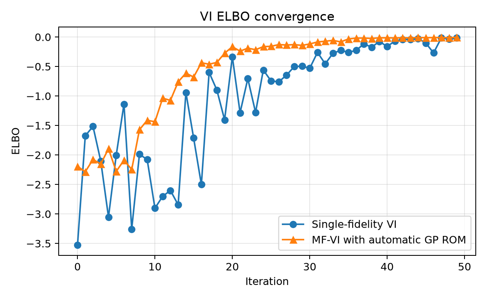
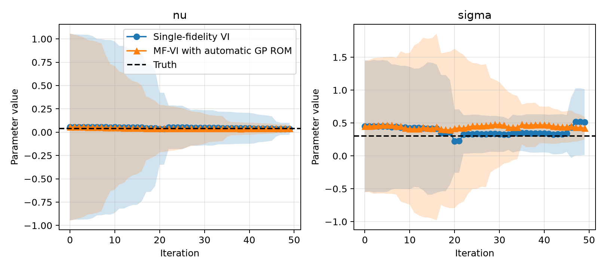

VI and MF-VI Demo
=================

This example compares single-fidelity variational inference with multifidelity
variational inference for a steady convection-diffusion-reaction model. Both
methods approximate the posterior over the diffusion coefficient ``nu`` and
reaction coefficient ``sigma`` with a Gaussian distribution.

Problem definition
------------------

The forward model solves the steady linear convection-diffusion-reaction
problem on the unit square,

.. math::

   -\nu \nabla^2 u + \mathbf{b}\cdot\nabla u + \sigma u = 1,
   \qquad \mathbf{b}=(1,1),

with homogeneous Dirichlet boundary conditions. The diffusion coefficient
:math:`\nu` and reaction coefficient :math:`\sigma` are treated as uncertain
parameters. The scalar quantity of interest approximates the integral of the
normal derivative on the right boundary,

.. math::

   Q(u) = \int_{x=1} \frac{\partial u}{\partial x}\,dy.

Synthetic observations are generated from the full-order model at

.. math::

   \nu_{\mathrm{true}} = 0.04,
   \qquad
   \sigma_{\mathrm{true}} = 0.30.

No random perturbation is added to the synthetic observation itself. The
likelihood assumes independent Gaussian observation noise with standard
deviation :math:`5\times 10^{-3}`, corresponding to covariance
:math:`2.5\times 10^{-5}` for the scalar observation.

The admissible parameter ranges are deliberately chosen so that their midpoint
is not the true parameter vector:

.. math::

   0.01 \leq \nu \leq 0.10,
   \qquad
   0.10 \leq \sigma \leq 0.80.

The Gaussian prior is initialized with the midpoint of these intervals as its
mean and one quarter of each interval width as its standard deviation. Thus,
its mean is :math:`(0.055, 0.45)`, rather than the truth
:math:`(0.04, 0.30)`. This avoids giving the inference problem an artificially
favorable initialization centered on the data-generating parameters.

The multifidelity method supplements its full-order-model samples with
additional evaluations of a Gaussian-process surrogate. The surrogate is
constructed automatically from the full-order-model parameter and QoI data,
with both inputs and targets normalized before fitting.

Run the example
---------------

The canonical implementation lives under ``examples/`` and is exercised
against the current romtools checkout in CI.

.. code-block:: bash

   python examples/vi_mf_vi_demo/example.py

A reduced configuration is available for quick validation:

.. code-block:: bash

   python examples/vi_mf_vi_demo/example.py --smoke

The full run uses 50 optimization iterations, eight FOM samples per iteration,
and 64 additional GP-ROM samples for MF-VI. The smoke configuration reduces
the grid, sample counts, and optimization iterations without changing the
workflow API being tested.

Regenerate the published figures
--------------------------------

The Sphinx build does not execute scientific examples implicitly. Regenerate
the checked-in figures explicitly after changes that affect this benchmark:

.. code-block:: bash

   python examples/vi_mf_vi_demo/example.py \
       --output-dir docs/source/demos/notebooks

Results
-------

   ELBO histories for single-fidelity VI and MF-VI with automatic GP-ROM
   construction.

   Variational means and one-standard-deviation bands for the inferred
   diffusion coefficient and reaction coefficient.

Implementation
--------------

.. literalinclude:: ../../../examples/vi_mf_vi_demo/example.py
   :language: python
   :linenos:
