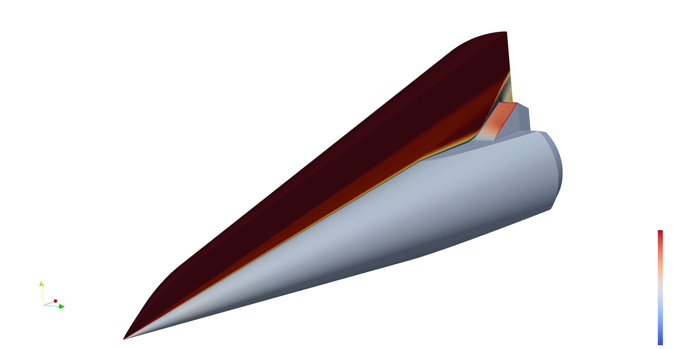

ROM-Tools at Scale: Example Applications
========================================

This feature page highlights two large-scale studies from the Pressio ecosystem
showcasing ROM construction and deployment in advanced workflows.

SPARC: Turbulent Flow UQ and Sensitivity
----------------------------------------

Pressio is coupled to SPARC for uncertainty quantification of a turbulent flow
over a cone-slice-wedge geometry with a 3D RANS solver and SA turbulence model.
The workflow targets high-fidelity UQ and sensitivity analysis while remaining
computationally practical.

   Cone-slice-wedge geometry with wall heat flux and a flow-field slice.

Key results:

- 48.27M finite volumes, 289.6M DOFs; FOM runs converge in roughly 2.0 hours on 12 nodes.
- Massive sample-level parallelism via asynchronous workflows, scaling UQ studies across many parameter evaluations.
- ROMs deliver sub-0.5% QoI errors, with the largest ROM below 0.1%.
- Speedups range from about 30x (coarse ROM) to 15x (fine ROM).
- Sobol sensitivity studies drop the estimated cost from ~110,000 to ~5,000 core-days.

.. grid:: 2
   :gutter: 2

   .. grid-item::

      .. figure:: _static/rom_tools_at_scale/fom_heat_flux_36.png
         :alt: FOM wall heat flux sample
         :align: center
         :width: 100%

         FOM wall heat flux, sample case.

   .. grid-item::

      .. figure:: _static/rom_tools_at_scale/rom_heat_flux_36.png
         :alt: ROM wall heat flux sample
         :align: center
         :width: 100%

         ROM wall heat flux, same sample case.

Aria: Thermal Protection System Inference
-----------------------------------------

Pressio powers a multi-fidelity ensemble Kalman inversion workflow to infer
temperature-dependent material properties for a thermal protection system using
SIERRA/Aria.

.. grid:: 2
   :gutter: 2

   .. grid-item::

      .. figure:: _static/rom_tools_at_scale/stv_render.png
         :alt: Paraboloid nose geometry rendering
         :align: center
         :width: 100%

         Paraboloid nose geometry rendering.

   .. grid-item::

      .. figure:: _static/rom_tools_at_scale/stv_xsect.png
         :alt: Paraboloid nose cross-section
         :align: center
         :width: 100%

         Paraboloid nose cross-section.

Key results:

- 475,588 DOFs with FOM runs around 630 seconds; ROM runs around 60 seconds.
- High-throughput multi-fidelity EKI leverages large, parallel batches of FOM and ROM evaluations per iteration.
- Multi-fidelity EKI reaches ~0.03% parameter error versus ~7% for FOM-only.
- MF EKI achieves comparable accuracy at roughly an order of magnitude less cost.

.. grid:: 2
   :gutter: 2

   .. grid-item::

      .. figure:: _static/rom_tools_at_scale/sample_mesh.png
         :alt: ROM sample mesh for TPS inference
         :align: center
         :width: 100%

         ROM sample mesh focused near the nose.

   .. grid-item::

      .. figure:: _static/rom_tools_at_scale/stv_t140.png
         :alt: Cross-sectional temperature field
         :align: center
         :width: 100%

         Cross-sectional temperature field.

Figures are sourced from the Pressio SOM paper examples.
